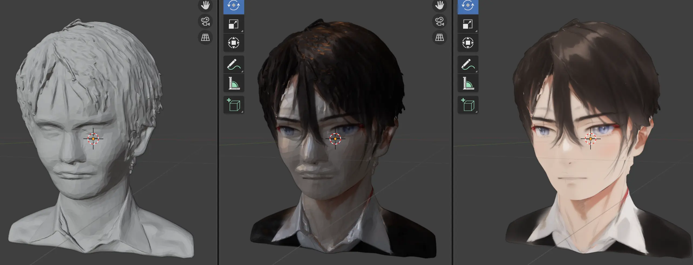

# Hunyuan3D-2 と SyncMVD を使ったテクスチャ付き3Dメッシュの作成支援ツール

Hunyuan3D-2でメッシュ生成（※）、SyncMVDでテクスチャ合成する場合、それぞれを個別に呼び出すのはそれなりに手間なので、1コマンドで使えるようにしただけです。SyncMVDの生成結果にアクセスしやすいようフォルダリンク（./MVD_latest/）も自動生成します。

※ 本来、Hunyuan3D-2ではメッシュ合成もできますが、ここではメッシュ生成だけを利用します



## 🔧 動作条件

本ツールは以下の外部ソフトウェアを subprocess 経由で使用します：

- [Hunyuan3D-2](https://github.com/Tencent/Hunyuan3D-2)：Tencent Hunyuan 3D 2.0 Community License
- [SyncMVD](https://github.com/LIU-Yuxin/SyncMVD) ：MIT License  

それぞれのライセンス条項に従ってご利用ください。Hunyuan3D-2 は特に注意が必要です。

（Hunyuan3D-2 と SyncMVD はそれぞれ Conda 環境で用意してください。 本ツールはPythonの標準ライブラリしか使わないのでLinuxディストリビューションのPythonで問題ありません。）

## 📦 本ツールのディレクトリ構成

```
project_root/
├── tkg_textured_mesh_gen.py         # メインスクリプト
├── config.yaml                      # 環境設定ファイル（要変更）
├── README.md                        # この説明書
├── LICENSE                          # ライセンス情報
└── external/
    └── tkg_image2mesh.py            # Hunyuan3D-2 にコピーして使用
```

## ① 最初にすること

`tkg_image2mesh.py` を Hunyuan3D-2 の直下にコピーしてください。

付記： Hunyuan3D-2では メッシュ生成を高速化する Turbo版が出ています。Turbo版を利用したい場合は Hunyuan3D-2/examples/fast_shape_gen_with_flashvdm.py を参考にして，tkg_image2mesh.py を書き換えるとよいでしょう。

## ② `config.yaml` の設定


```yaml
hunyuan:
  dir: "/home/<USER_NAME>/Hunyuan3D-2"
  conda_python: "/home/<USER_NAME>/miniconda3/envs/hunyuan3d/bin/python"
  script: "tkg_image2mesh.py"

syncmvd:
  dir: "/home/<USER_NAME>/SyncMVD"
  conda_python: "/home/<USER_NAME>/miniconda3/envs/syncmvd/bin/python"
  script: "run_experiment.py"
```

### 🔸ヒント：
- 自分の環境に合わせて書き換えてください。
- SyncMVD のスクリプトは `run_experiment.py` （←SyncMVD側で用意しているファイル）となっていますが適宜変更してください。画像生成時のチェックポイントやVAEを変えるなど、run_experiment.py を改変して使っている場合はそのファイル名を指定してください）。

## 🚀 簡単な使い方

3通りの使い方があります。
 
### ① Hunyuan3D-2でメッシュ生成，SyncMVDでテクスチャを合成を行う場合

```bash
python tkg_textured_mesh_gen.py \
  --input-image input.png \
  --output-mesh mymesh.glb \
  --prompt "a photo of ......"
```

--prompt は SyncMVDに渡すプロンプトです。また、--seedなども設定できます（--helpで確認）。

### ② Hunyuan3D-2でメッシュ生成のみを行う場合
  
```bash
python tkg_textured_mesh_gen.py \
  --input-image input.png \
  --output-mesh mymesh.glb 
```
 --prompt 指定を外すとメッシュ生成だけを行います

### ③ 生成済みメッシュを使って，SyncMVDでテクスチャ合成のみ行う場合

```bash
python tkg_textured_mesh_gen.py \
  --input-mesh ./smvd_output/mymesh.glb \
  --prompt "a photo of ......"
```


## 参考（一連の環境構築の作業）

まずは Hunyuan3D-2 の準備
```
$ cd ~/
$ git clone https://github.com/Tencent/Hunyuan3D-2
$ cd Hunyuan3D-2
$ conda create -n hunyuan3d .....
   :  
$ conda deactivate
```
続いて SyncMVD の準備
```
$ cd ~/
$ git clone https://github.com/LIU-Yuxin/SyncMVD
$ cd SyncMVD
$ conda create -n syncmvd .....
   :
   :
$ conda deactivate
```
そして 本ツールの準備
```
$ cd ~/ 
$ git clone https://github.com/takago/h3d-smvd-wrapper.git
$ cd h3d-smvd-wrapper/
$ cp external/tkg_image2mesh.py ~/Hunyuan3D-2/

$ vi ~/SyncMVD/run_experiment.py
   (必要に応じてチェックポイントやVAEなどを変更)

$ vi config.yaml
   (書き換え)
```
実行（画像→テクスチャ付きメッシュ）
```
$ python3 tkg_textured_mesh_gen.py --input-image input.png --output-mesh mymesh.glb --prompt "A photo of ...

 終わるのを待つ
 
$ tree -F .
.
├── LICENSE
├── MVD_latest -> smvd/MVD_30Apr2025-173120/  .... 最後にSyncMVDで生成した出力へのシンボリックリンク
├── smvd_output/
│   └── MVD_30Apr2025-173120/  .............  SyncMVDによって作られる
│       ├── config.yaml
│       ├── intermediate/
│       │   ├── cond.jpg
│       │   ├── step_03.jpg
│       │   :
│       │   ├── step_27.jpg
│       │   ├── step_29.jpg
│       │   ├── texture_03.png
│       │   :
│       │   └── texture_19.png
│       └── results/    ...... 生成されたテクスチャ付きメッシュ
│           ├── textured.mtl
│           ├── textured.obj
│           ├── textured.png
│           └── textured_views_rgb.jpg
├── README.md
├── config.yaml
├── external/
│   └── tkg_image2mesh.py
├── mymesh.glb      ............. Hunyuan3D-2で生成されたメッシュ画像
├── mymesh.webp     ............. 背景を除去された入力画像
├── input.png       ............. 入力画像
└── tkg_textured_mesh_gen.py


$ f3d mymesh.glb &
 （メッシュの確認）

$ f3d MVD_latest/results/textured.obj &
 （テクスチャ付きメッシュの確認）

```
テクスチャ付きメッシュを再生成（必要に応じてシードを変えたり，プロンプトを変えたりするとよい）
```
$ python3 tkg_textured_mesh_gen.py --input-mesh ./smvd_output/hello.glb  --prompt "A photo of ...."
```
